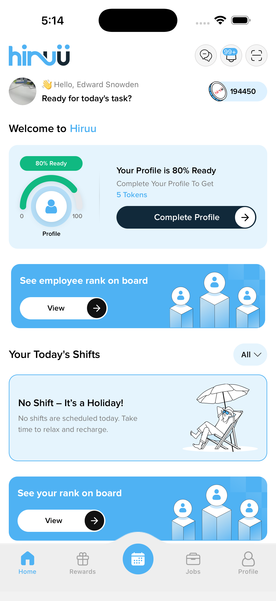
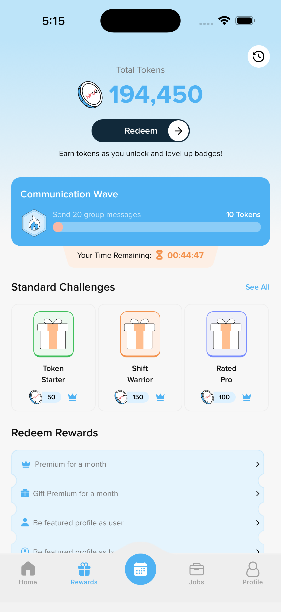
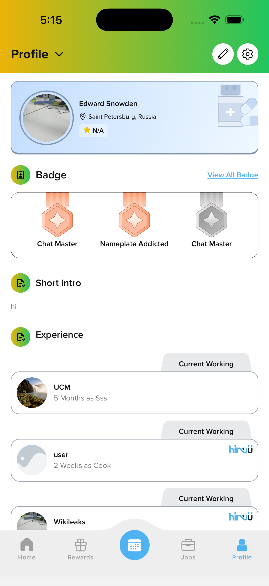
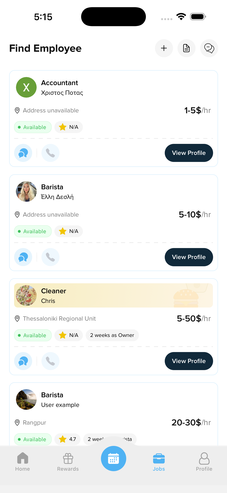
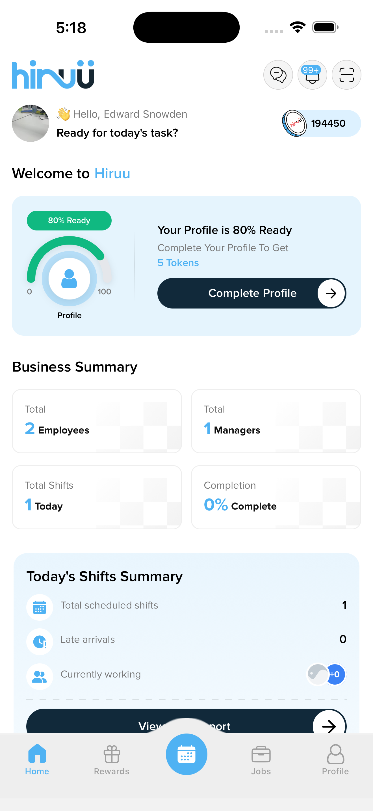
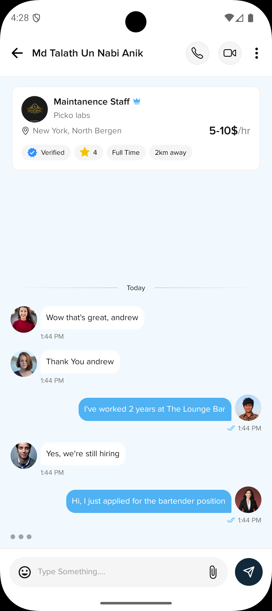
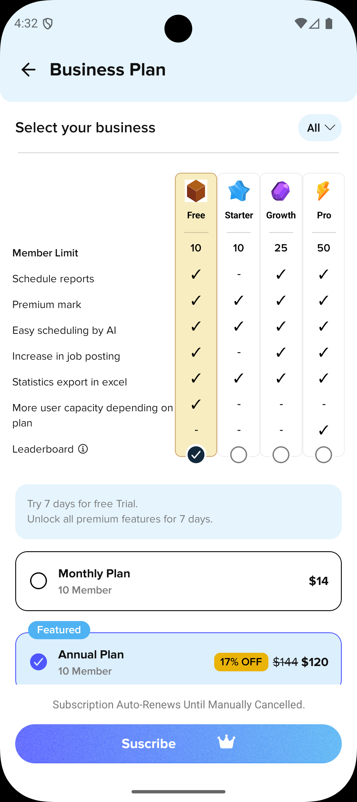
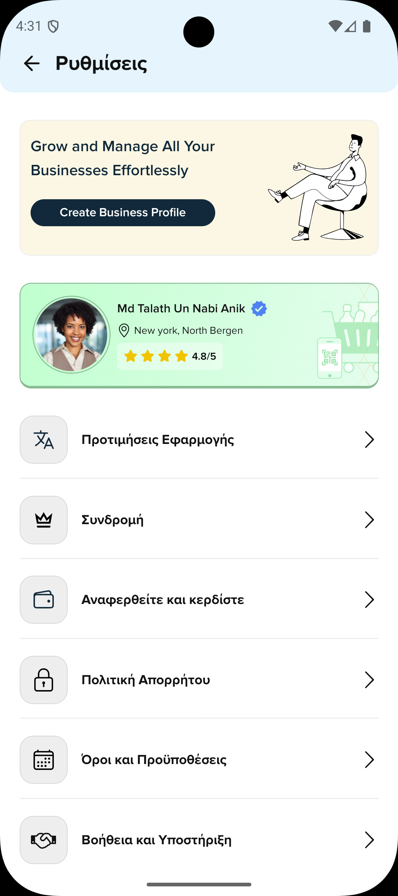
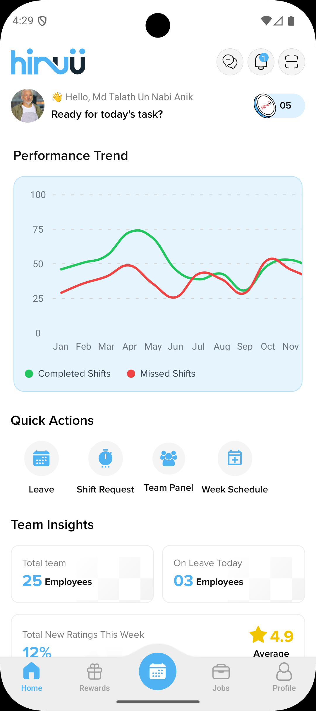
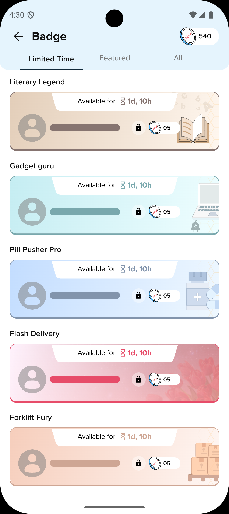

# Hiruu

A modern job marketplace and workforce management platform built with React Native and Expo, connecting job seekers with employers through shift scheduling, real-time messaging, rewards, and team management.

## Screenshots

<p align="center">
  
  
  
  
</p>
<p align="center">
  
  
  
  
</p>
<p align="center">
  
  
</p>

## Features

- **Job Discovery** — Browse and apply for job opportunities with detailed listings, pay rates, and availability status
- **Shift Management** — View scheduled shifts, track hours, request overtime, and swap shifts
- **Performance Tracking** — Monitor completed vs missed shifts with trend charts
- **Rewards & Badges** — Earn tokens by completing challenges and unlocking badges, redeem for premium features
- **Profile & CV** — Build a professional profile with experience, skills, and a CV preview
- **In-App Messaging** — Chat directly with employers and team members with real-time delivery status
- **QR Code Check-in** — Scan or generate QR codes for shift attendance
- **Business Dashboard** — Overview of employees, managers, shifts, and completion rates
- **Team Management** — Manage team members, roles, and permissions
- **Job Posting** — Create, edit, and manage job listings with filtering
- **Schedule Management** — Create weekly schedules, shift templates, and assign employees
- **Subscription Plans** — Free, Starter, Growth, and Pro tiers with Stripe integration
- **Multi-language Support** — English and Greek localization via i18next
- **Push Notifications** — Firebase Cloud Messaging for real-time alerts
- **Authentication** — Email, Google Sign-In, and Apple Sign-In
- **Audio & Video Calls** — Agora-powered calling for interviews and team communication

## Tech Stack

| Category | Technology |
| --- | --- |
| Framework | React Native 0.85 + Expo 56 |
| Navigation | Expo Router 56 |
| Styling | NativeWind (Tailwind CSS) |
| State Management | Zustand |
| Authentication | Firebase Auth + Google Sign-In + Apple Sign-In |
| Payments | Stripe React Native |
| Real-time | Socket.io Client |
| Push Notifications | Firebase Cloud Messaging |
| Localization | i18next + React i18next |
| Calls | Agora React Native |
| Language | TypeScript |

## Prerequisites

- **Node.js** v18 or higher — [Download](https://nodejs.org/)
- **npm** or **yarn** package manager
- **Git** — [Download](https://git-scm.com/)

### iOS Development

- macOS (required)
- Xcode (latest version from App Store)
- CocoaPods — `sudo gem install cocoapods`

### Android Development

- Android Studio — [Download](https://developer.android.com/studio)
- Java Development Kit (JDK) 17

### Physical Device Testing

- [Expo Go](https://apps.apple.com/app/expo-go/id982107779) (iOS) or [Google Play](https://play.google.com/store/apps/details?id=host.exp.exponent) (Android)

## Getting Started

### 1. Clone the Repository

```bash
git clone https://github.com/xyryc/Hiruu-App.git
cd Hiruu-App
```

### 2. Install Dependencies

```bash
npm install
```

### 3. Configure Environment Variables

Create a `.env` file in the root directory:

```env
EXPO_PUBLIC_API_URL=your_api_url
EXPO_PUBLIC_GEOAPIFY_API_KEY=your_geoapify_key
EXPO_PUBLIC_STRIPE_PUBLISHABLE_KEY=your_stripe_key
EXPO_PUBLIC_GOOGLE_WEB_CLIENT_ID=your_google_client_id
```

### 4. Start the Development Server

```bash
npx expo start
```

Scan the QR code with Expo Go on your device, or press `a` for Android emulator / `i` for iOS simulator.

## Running on Emulators

### Android

```bash
npx expo run:android
```

Requires Android Studio with a running emulator or a connected device with USB debugging enabled.

### iOS (macOS only)

```bash
npx expo run:ios
```

First time setup:

```bash
cd ios && pod install && cd ..
```

## Building APK

### Local Build (Debug)

```bash
npx expo prebuild --platform android
cd android && ./gradlew assembleDebug
```

APK output: `android/app/build/outputs/apk/debug/app-debug.apk`

### GitHub Actions Build

```bash
git tag v1.x.x
git push origin v1.x.x
```

Find the APK in your repository's **Actions** tab under **Artifacts** after the workflow completes.

### Signed Build (Production)

Generate a keystore and configure `android/gradle.properties`:

```properties
MYAPP_UPLOAD_STORE_FILE=my-app-key.keystore
MYAPP_UPLOAD_KEY_ALIAS=my-app-alias
MYAPP_UPLOAD_STORE_PASSWORD=your_password
MYAPP_UPLOAD_KEY_PASSWORD=your_password
```

Then build:

```bash
cd android && ./gradlew assembleRelease
```

## Available Scripts

| Command | Description |
| --- | --- |
| `npm start` | Start Expo development server |
| `npm run android` | Run on Android emulator/device |
| `npm run ios` | Run on iOS simulator/device |
| `npm run web` | Start web development server |
| `npm run lint` | Run ESLint |
| `npx expo prebuild --clean` | Regenerate native project files |

## Environment

- Expo: ~56.0.4
- Node.js: v20.20.2
- Android SDK Build Tools: 37.0.0
- Android SDK Platform Tools: 37.0.0
- NDK: 27.1.12297006

## Troubleshooting

**Metro bundler issues:**
```bash
npx expo prebuild --clean
```

**Module not found errors:**
```bash
rm -rf node_modules package-lock.json
npm install
```

**iOS build fails:**
```bash
cd ios && rm -rf Pods Podfile.lock
rm -rf ~/Library/Developer/Xcode/DerivedData
pod install
```

**Android build fails:**
```bash
cd android && ./gradlew clean
```

## Resources

- [Expo Documentation](https://docs.expo.dev/)
- [React Native Documentation](https://reactnative.dev/)
- [Expo Router](https://docs.expo.dev/router/introduction/)
- [NativeWind](https://www.nativewind.dev/)
- [Zustand](https://zustand-demo.pmnd.rs/)

## Developer

**Md Talath Un Nabi** — Lead App Developer — [GitHub](https://github.com/xyryc)

## Support

For support, email `mdtalathunnabi@gmail.com`
